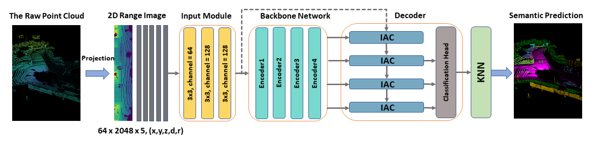

# RangeSeg
> This is the official implementation of **RangeSeg: Efficient Lidar Semantic Segmentation on Range view**[[Paper](https://arxiv.org/pdf/2301.04275.pdf)]. [](https://arxiv.org/abs/2301.04275) 
## Demo
<p align="center"> </a> </p>

## Environment
```sh
# clone this repo
git clone https://github.com/fengluodb/LENet.git

# create a conda env with
conda env create -f environment.yaml
conda activate LENet
```

## Datasets Prepartion
### SemanticKITTI
Download the SemanticKIITI dataset from [here](http://www.semantic-kitti.org/dataset.html#download). 
```
dataset
└── SemanticKITTI
    └── sequences
        ├── 00
        ├── ...
        └── 21
```


### SemanticPOSS
Download the SemanticPOSS dataset from [here](http://www.poss.pku.edu.cn./semanticposs.html). Unzip and arrange it as follows. 
```
dataset
└── SemanticPOSS
    └── sequences
        ├── 00
        ├── ...
        └── 05
```

### Nuscenes
Download the nuScenes dataset from [here](https://nuscenes.org/nuscenes). Using the [nuscenes2kitti.py](/utils/nuscenes2kitti.py) to nuScenes into SemanticKITTI-compatible format, you can follw the instructions in [here](https://github.com/PRBonn/nuscenes2kitti):
```sh
python3 utils/nuscenes2kitti.py --nuscenes_dir <nuscenes_directory> --output_dir <output_directory>
```
the final format look like this:
```sh
dataset/Nuscene-KITTI/
└── sequences
    ├── 0001
    ├── 0002
    ├── ...
    ├── 1109
    └── 1110
```

## Training

### SemanticKITTI
To train a network (from scratch):
```sh
python train.py -d DATAROOT -ac config/arch/LENet.yaml -dc config/labels/semantic-kitti.yaml -l logs/LENet-KITTI
```

To train a network (from pretrained model):
```sh
python train.py -d DATAROOT -ac config/arch/LENet.yaml -dc config/labels/semantic-kitti.yaml -l logs/LENet-KITTI -p "logs/LENet-KITTI/TIMESTAMP" 
```

### SemanticPOSS
To train a network (from scratch):
```sh
python train_poss.py -d DATAROOT -ac config/arch/LENet_poss.yaml -dc config/labels/semantic-poss.yaml -l logs/LENet-POSS
```

To train a network (from pretrained model):
```sh
python train_poss.py -d DATAROOT -ac config/arch/LENet_poss.yaml -dc config/labels/semantic-poss.yaml -l logs/LENet-POSS -p "logs/LENet-POSS/TIMESTAMP""
```

### Nuscenes
To train a network (from scratch):
```sh
python train_nusc.py -d DATAROOT -ac config/arch/LENet_nusc.yaml -dc config/labels/semantic-nuscenes.yaml -l logs/LENet-Nusc
```

To train a network (from pretrained model):
```sh
python train_nusc.py -d DATAROOT -ac config/arch/LENet_nusc.yaml -dc config/labels/semantic-nuscenes.yaml -l logs/LENet-Nusc -p "logs/LENet-Nusc/TIMESTAMP""
```

## Inference

### SemanticKITTI
```sh
python infer.py -d DATAROOT -m "logs/LENet-KITTI/TIMESTAMP" -l /path/for/predictions -s valid/test
```

### SemanticPOSS
```sh
python infer.py -d DATAROOT -m "logs/LENet-POSS/TIMESTAMP" -l /path/for/predictions -s valid
```

### Nuscenes
```sh
python infer.py -d DATAROOT -m "logs/LENet-KITTI/TIMESTAMP" -l /path/for/predictions -s valid/test
```

> warning: if you infer the test dataset, I have converted the result format into nuScenes format. But the output have label 0 in prediction. Therefore, the result can't pass the [valid submisson script](/utils/validate_submission.py) of nuScenes. I will find a way to solve it.

## Evalution

### SemanticKITTI
```sh
python evaluate.py -d DATAROOT -p /path/for/predictions -dc config/labels/semantic-kitti.yaml
```

### SemanticPOSS
```sh
python evaluate.py -d DATAROOT -p /path/for/predictions -dc config/labels/semantic-poss.yaml
```

### Nuscenes
```sh
python evaluate.py -d DATAROOT -p /path/for/predictions -dc config/labels/semantic-nuscenes.yaml
```

## Pretrained Models and Predictions

| dataset | mIoU |  Download |
|---------------|:----:|:-----------:|
| [SemanticKITTI(single)](config/arch/LENet.yaml) | 64.5(test) | [Model Weight And Predictions](https://drive.google.com/drive/folders/1ejoInYl8BVzg3t69_ig4tDUYstaz--Ns?usp=sharing) |
| [SemanticKITTI(multi)](config/arch/LENet.yaml) | 53.0(test) | [Model Weight And Predictions](https://drive.google.com/drive/folders/1OfktGL85mFmdRALBb-_Zpc8VSmjXJVYU?usp=sharing) |
| [SemanticPOSS](config/arch/LENet_poss.yaml) | 53.8(test) | [Model Weight And Predictions](https://drive.google.com/drive/folders/1oECv2GRCXZ1RIQVVum-mRwZbod8pxVA8) |
| [Nuscenes](config/arch/LENet_nusc.yaml) | 64.0(valid) | [Model Weight And Predictions](https://drive.google.com/drive/folders/1gFng2Ob3Papqddh4jK6g6cJeh2KWpS0f) |
## Acknowlegment

This repo is built based on [MotionSeg3D](https://github.com/haomo-ai/MotionSeg3D), [FIDNet](https://github.com/placeforyiming/IROS21-FIDNet-SemanticKITTI) and [CENet](https://github.com/huixiancheng/CENet). Thanks the contributors of these repos!
